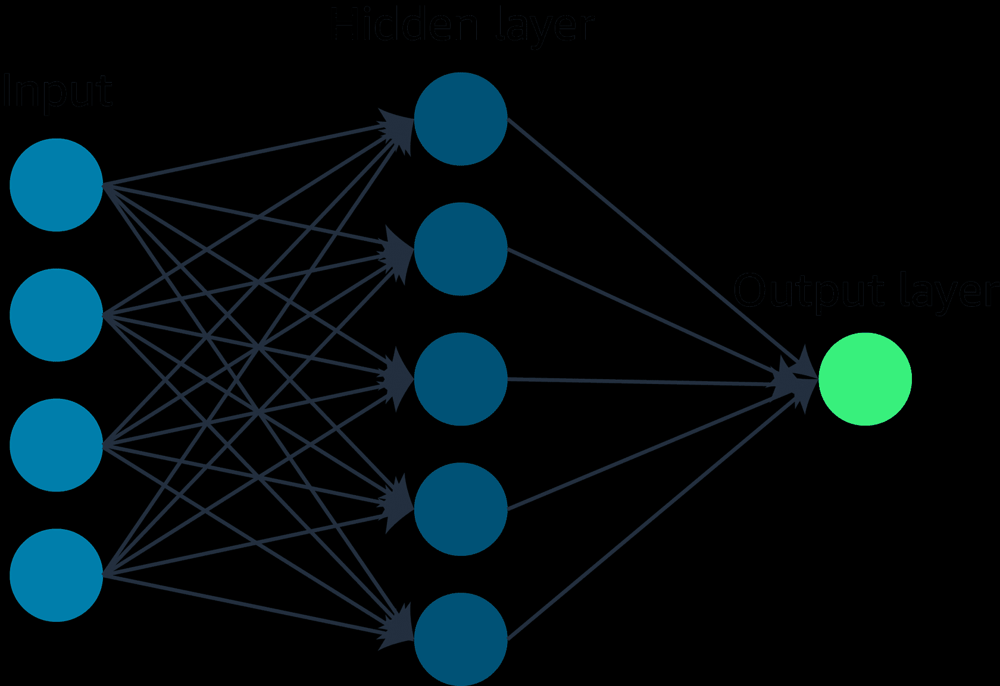

# AI Practitioner Certification

Those documentations are for AWS AI Practitioner Certification based on Skill Builder course at [AWS Skill Builder](https://explore.skillbuilder.aws/learn/course/external/view/elearning/127/aws-certified-ai-practitioner).

## Description

Generative AI is a branch of artificial intelligence that focus on creating new content, such as text, images, audio, or even computer code, from existing data. Those are the similarities and differences between those technologies:
- `Artificial Intelligence (AI)`: AI is a broad field that encompasses the development of intelligent systems capable of performing tasks that typically require human intelligence, such as problem-solving, decision-making, and natural language understanding. Generative AI is a subset of AI that specifically
- `Machine Learning (ML)`: ML is a type of AI for understanding and building methods that make it possible for machines to learn.
- `Deep Leainig (DL)`: DL uses the concept of neurons and synapses similar to how our brain is wired.
- `Generative AI`: Generative AI is subset of deep learning because it can adapt models built using deep learning, but without retraining or fine tuning the model.

## Machine Learning fundamentals:

Building a machine learning involves data collection and preparation, selecting an appropriate algorithm, training the model on the prepared data, and evaluating its performance through testing and iteration.

### Machine Learning categories

There are three broad categories of ML:
- `Supervised Learning`: In supervised learning, the algorithms are trained on labeled data. The goal is to learn a mapping function that can predict the output for new, unseen input data.
- `Unsupervised Learning`: It refers to algorithms that learn from unlabeled data. The goal is to discover inherent patterns, structures, or relationships within the input data.
- `Reinforcement Learning`: It is given only a performance score as guidance and semi-supervised learning, where only a portion of training data is labeled. The feedback is provided in the form of rewards or penalties for its actions, and the machine learns from this feedback to improve its decision-making over time.

### Deep Learning fundamentals

The field of deep learning is inspired by the structure and function of the brain. It involves the use of artificial neural networks, which are computational models that are designed to mimic the way the human brain processes information.

### Generative AI fundamentals

Generative AI is powered by models that are pre-trained on internet-scale data, and these models area called foundation models(FMs). You can adapt a single FM to perform multiple tasks, such as text generation, image generation, and code generation. There are eight FM lifecycles:
- Data selection
- Pre-training
- Optimization
- Evaluation
- Deployment
- Feedback and Continuous improvement

#### Retrieval-augmented generation (RAG)

RAG is a technique that supplies domain-relevant data as context to produce responses based on that data. This technique is similar to fine-tuning, but RAG retrieves a small set of relevant documents and uses that to provide context to answer the user prompt.

## AWS Infrastructure and Technologies

