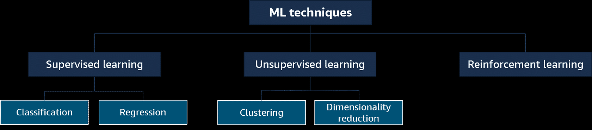
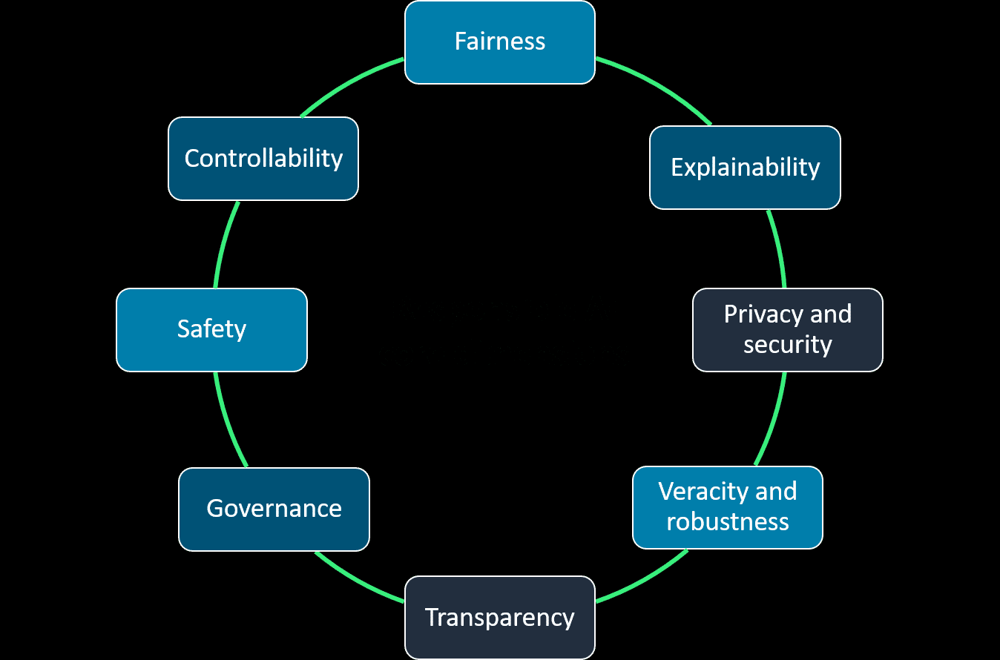

# AI Practitioner Certification

Those documentations are for AWS AI Practitioner Certification based on Skill Builder course at [AWS Skill Builder](https://explore.skillbuilder.aws/learn/course/external/view/elearning/127/aws-certified-ai-practitioner).

## Description

Generative AI is a branch of artificial intelligence that focus on creating new content, such as text, images, audio, or even computer code, from existing data. Those are the similarities and differences between those technologies:
- `Artificial Intelligence (AI)`: AI is a broad field that encompasses the development of intelligent systems capable of performing tasks that typically require human intelligence, such as problem-solving, decision-making, and natural language understanding. Generative AI is a subset of AI that specifically
- `Machine Learning (ML)`: ML is a type of AI for understanding and building methods that make it possible for machines to learn.
- `Deep Leainig (DL)`: DL uses the concept of neurons and synapses similar to how our brain is wired.
- `Generative AI`: Generative AI is subset of deep learning because it can adapt models built using deep learning, but without retraining or fine tuning the model.

## Machine Learning fundamentals:

Building a machine learning involves data collection and preparation, selecting an appropriate algorithm, training the model on the prepared data, and evaluating its performance through testing and iteration.

### Machine Learning categories

There are three broad categories of ML:
- `Supervised Learning`: In supervised learning, the algorithms are trained on labeled data. The goal is to learn a mapping function that can predict the output for new, unseen input data.
- `Unsupervised Learning`: It refers to algorithms that learn from unlabeled data. The goal is to discover inherent patterns, structures, or relationships within the input data.
- `Reinforcement Learning`: It is given only a performance score as guidance and semi-supervised learning, where only a portion of training data is labeled. The feedback is provided in the form of rewards or penalties for its actions, and the machine learns from this feedback to improve its decision-making over time.

### Deep Learning fundamentals

The field of deep learning is inspired by the structure and function of the brain. It involves the use of artificial neural networks, which are computational models that are designed to mimic the way the human brain processes information.

### Generative AI fundamentals

Generative AI is powered by models that are pre-trained on internet-scale data, and these models area called foundation models(FMs). You can adapt a single FM to perform multiple tasks, such as text generation, image generation, and code generation. There are eight FM lifecycles:
- Data selection
- Pre-training
- Optimization
- Evaluation
- Deployment
- Feedback and Continuous improvement

#### Retrieval-augmented generation (RAG)

RAG is a technique that supplies domain-relevant data as context to produce responses based on that data. This technique is similar to fine-tuning, but RAG retrieves a small set of relevant documents and uses that to provide context to answer the user prompt.

## AWS Infrastructure and Technologies

### Amazon SageMaker

With SageMaker, you can build, train, and deploy ML models for any use case with fully managed infrastructure, tools, and workflows. It removes the heavy lifting from each step of the ML process to make it easier to develop high-quality models.

#### SageMaker JumpStart

It helps you quickly get started with ML providing a set of solutions for the most common cases, which can be rapidly deployed. It is also supports one-click deployment and fine-tuning of more that 150 popular open-source models such as natural language processing, object detection, and image classification models.

### Amazon Comprehend

It uses ML and natural language processing(NLP) to help you uncover the insights and relationships in your unstructured data. It can perform:
- Identifies the language of the text;
- Extracts key phrases, places, people, brands, or events;
- Understand how positive or negative the text is;
- Analyzes text using tokenization and parts of  speech;
- And automatically organizes a collection of text files by topic;

### Amazon Translate

It is a neural machine translation service that delivers fast, high-quality, and affordable language translation which uses deep learning models to deliver more accurate and more natural-sounding translation statistical and rule-based translation algorithms.

### Amazon Textract

It is a service that automatically extracts text and data from scanned documents It goes beyond optical character recognition (OCR) to also identify the contents of fields in forms and information stored in tables.

### Amazon Lex

It is a fully managed AI service to design, build, text, and deploy conversation interfaces into any application using voice and text like chatbots. It provides the advanced deep learning functionalities of automatic speech recognition (ASR) for converting speech to text, and natural language understanding(NLU) to recognize the intent of the text and respond to the user in a natural way.

### Amazon Polly

It is a service that turns text into lifelike speech. It lets you create application that talks, so you can build entirely new categories of speech-enabled products and it uses DL to synthesize speech that sounds like human voice.

### Amazon Transcribe

It is an automatic speech recognition (ASR) service for automatically converting speech to text. It can describe audio files with timestamps so that you can quickly locate the audio in the original file by searching for the text or transcript audio stream in real time.

### Amazon Rekognition

It facilitates adding image and video analysis to your applications. It uses prove, highly scalable, DL-based that requires no ML expertise to use.

### Amazon Kendra

It is an intelligent search service powered by ML. It reimagines enterprise search for your websites and applications.

### Amazon Personalize

It is a ML service that developers can use to create individualized recommendations for customers who use their applications.

### AWS DeepRacer

It is a 1/18th scale race car that gives you an interesting and fun way to get started with reinforcement learning (RL) which is an advanced ML technique that takes a very different approach to training models that other ML methods. Its superpower is that it learns very complex behaviors without requiring any labeled training data, and it can make short-term decisions while optimizing for a longer-term goal.

### Amazon Bedrock

It a fully managed service that makes FMs from Amazon and leading AI startups available through an API. It is serverless experience that you can get started experimenting with FMs, privately customize them with your own data, and seamlessly integrate and deploy FMs into your application.

### Amazon Q

It can help you get fast, relevant answers to pressing questions, solve problems, generate content, and take actions using the data and expertise found in your company's information repositories, code, and enterprise systems. It provides immediate, relevant information and advice to help streamline tasks, speed decisions-making, and help spark creativity and innovation.

#### Amazon Q Developer

Designed to improve developer productivity, it provides ML-powered code recommendations to accelerate development of coding.

## Factors to consider when selecting a AI model

- Model types;
- Performance requirements;
- Capabilities;
- Constraints;
- Compliance;

## What is responsible AI?

It refers to practices and principles that ensure that AI systems are transparent and trustworthy while mitigating potential risks and negative outcomes. Those should be considered in all lifecycle which include:

### Core dimensions of responsible AI

The core dimensions of responsible AI include:

