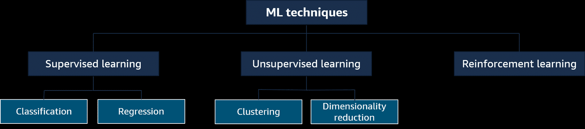
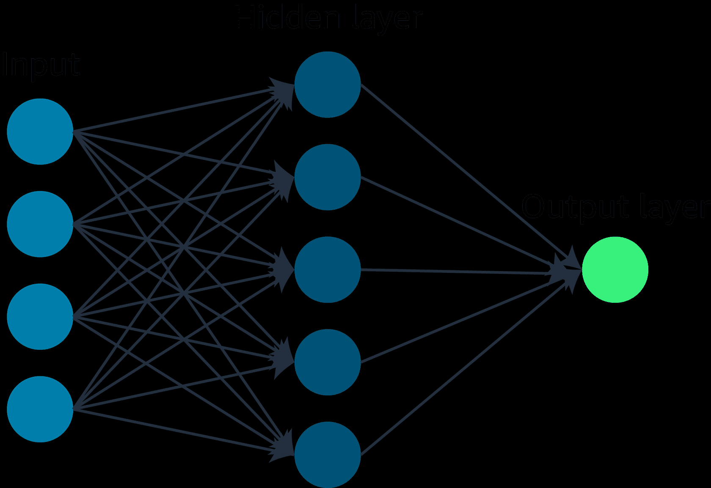
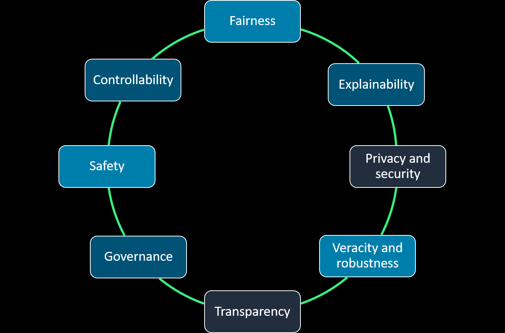
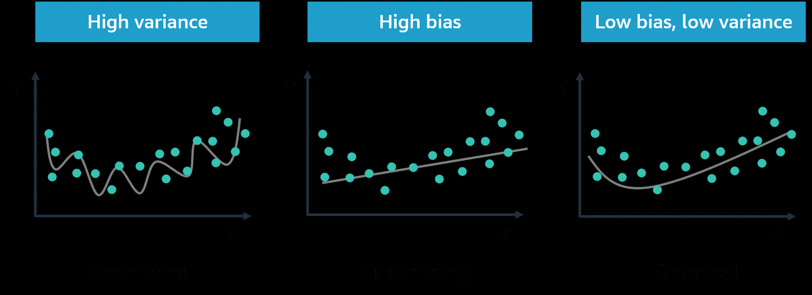

# AI Practitioner Certification

Those documentations are for AWS AI Practitioner Certification based on Skill Builder course at [AWS Skill Builder](https://explore.skillbuilder.aws/learn/course/external/view/elearning/127/aws-certified-ai-practitioner).

## Description

Generative AI is a branch of artificial intelligence that focus on creating new content, such as text, images, audio, or even computer code, from existing data. Those are the similarities and differences between those technologies:
- `Artificial Intelligence (AI)`: AI is a broad field that encompasses the development of intelligent systems capable of performing tasks that typically require human intelligence, such as problem-solving, decision-making, and natural language understanding. Generative AI is a subset of AI that specifically
- `Machine Learning (ML)`: ML is a type of AI for understanding and building methods that make it possible for machines to learn.
- `Deep Leainig (DL)`: DL uses the concept of neurons and synapses similar to how our brain is wired.
- `Generative AI`: Generative AI is subset of deep learning because it can adapt models built using deep learning, but without retraining or fine tuning the model.

## Machine Learning fundamentals:

Building a machine learning involves data collection and preparation, selecting an appropriate algorithm, training the model on the prepared data, and evaluating its performance through testing and iteration.

### Machine Learning categories

There are three broad categories of ML:
- `Supervised Learning`: In supervised learning, the algorithms are trained on labeled data. The goal is to learn a mapping function that can predict the output for new, unseen input data.
- `Unsupervised Learning`: It refers to algorithms that learn from unlabeled data. The goal is to discover inherent patterns, structures, or relationships within the input data.
- `Reinforcement Learning`: It is given only a performance score as guidance and semi-supervised learning, where only a portion of training data is labeled. The feedback is provided in the form of rewards or penalties for its actions, and the machine learns from this feedback to improve its decision-making over time.

### Deep Learning fundamentals

The field of deep learning is inspired by the structure and function of the brain. It involves the use of artificial neural networks, which are computational models that are designed to mimic the way the human brain processes information.

### Generative AI fundamentals

Generative AI is powered by models that are pre-trained on internet-scale data, and these models area called foundation models(FMs). You can adapt a single FM to perform multiple tasks, such as text generation, image generation, and code generation. There are eight FM lifecycles:
- Data selection
- Pre-training
- Optimization
- Evaluation
- Deployment
- Feedback and Continuous improvement

#### Retrieval-augmented generation (RAG)

RAG is a technique that supplies domain-relevant data as context to produce responses based on that data. This technique is similar to fine-tuning, but RAG retrieves a small set of relevant documents and uses that to provide context to answer the user prompt.

## AWS Infrastructure and Technologies

### Amazon SageMaker

With SageMaker, you can build, train, and deploy ML models for any use case with fully managed infrastructure, tools, and workflows. It removes the heavy lifting from each step of the ML process to make it easier to develop high-quality models.

#### SageMaker JumpStart

It helps you quickly get started with ML providing a set of solutions for the most common cases, which can be rapidly deployed. It is also supports one-click deployment and fine-tuning of more that 150 popular open-source models such as natural language processing, object detection, and image classification models.

### Amazon Comprehend

It uses ML and natural language processing(NLP) to help you uncover the insights and relationships in your unstructured data. It can perform:
- Identifies the language of the text;
- Extracts key phrases, places, people, brands, or events;
- Understand how positive or negative the text is;
- Analyzes text using tokenization and parts of  speech;
- And automatically organizes a collection of text files by topic;

### Amazon Translate

It is a neural machine translation service that delivers fast, high-quality, and affordable language translation which uses deep learning models to deliver more accurate and more natural-sounding translation statistical and rule-based translation algorithms.

### Amazon Textract

It is a service that automatically extracts text and data from scanned documents It goes beyond optical character recognition (OCR) to also identify the contents of fields in forms and information stored in tables.

### Amazon Lex

It is a fully managed AI service to design, build, text, and deploy conversation interfaces into any application using voice and text like chatbots. It provides the advanced deep learning functionalities of automatic speech recognition (ASR) for converting speech to text, and natural language understanding(NLU) to recognize the intent of the text and respond to the user in a natural way.

### Amazon Polly

It is a service that turns text into lifelike speech. It lets you create application that talks, so you can build entirely new categories of speech-enabled products and it uses DL to synthesize speech that sounds like human voice.

### Amazon Transcribe

It is an automatic speech recognition (ASR) service for automatically converting speech to text. It can describe audio files with timestamps so that you can quickly locate the audio in the original file by searching for the text or transcript audio stream in real time.

### Amazon Rekognition

It facilitates adding image and video analysis to your applications. It uses prove, highly scalable, DL-based that requires no ML expertise to use.

### Amazon Kendra

It is an intelligent search service powered by ML. It reimagines enterprise search for your websites and applications.

### Amazon Augmented AI(A2I)

It is a fully managed service that makes it easy to build the workflows required for human review of ML predictions. It provides built-in human review workflows for common use cases such as content moderation and document analysis, and you can also create custom workflows to fit your specific needs.

### Amazon Personalize

It is a ML service that developers can use to create individualized recommendations for customers who use their applications.

### AWS DeepRacer

It is a 1/18th scale race car that gives you an interesting and fun way to get started with reinforcement learning (RL) which is an advanced ML technique that takes a very different approach to training models that other ML methods. Its superpower is that it learns very complex behaviors without requiring any labeled training data, and it can make short-term decisions while optimizing for a longer-term goal.

### Amazon Bedrock

It a fully managed service that makes FMs from Amazon and leading AI startups available through an API. It is serverless experience that you can get started experimenting with FMs, privately customize them with your own data, and seamlessly integrate and deploy FMs into your application.

### Amazon Q

It can help you get fast, relevant answers to pressing questions, solve problems, generate content, and take actions using the data and expertise found in your company's information repositories, code, and enterprise systems. It provides immediate, relevant information and advice to help streamline tasks, speed decisions-making, and help spark creativity and innovation.

#### Amazon Q Developer

Designed to improve developer productivity, it provides ML-powered code recommendations to accelerate development of coding.

## Factors to consider when selecting a AI model

- Model types;
- Performance requirements;
- Capabilities;
- Constraints;
- Compliance;

## What is responsible AI?

It refers to practices and principles that ensure that AI systems are transparent and trustworthy while mitigating potential risks and negative outcomes. Those should be considered in all lifecycle which include Design, Development, Deployment, Monitoring and Evaluation.

### Accuracy of models

*Bias* in a model means that the model is missing important features of the datasets. It is to basic. Bias is measured by the difference between the expected predictions of the model and the true values we are trying to predict. If the difference is narrow, then the model has low bias. If the difference is wide, then the model has high bias.

Variance refers to the model's sensitivity to fluctuations or noise in the training data. The model might consider noise in the data to be important in the output. When variance is high, the model becomes so familiar with the training data that it can make predictions with high accuracy. However, when you introduce new data to the model, the model's accuracy drops. This introduces the problem of overfitting. It means when a model performs well on the training data but does not perform well on the evaluation data.

### Core dimensions of responsible AI

The core dimensions of responsible AI include:

- `Fairness`: It is crucial for developing responsible AI systems, because they will promote inclusion, prevent discrimination, uphold responsible values and legal norms, and build trust with society.
- `Explainability`: It refers to the ability of an IA model to clearly explain or provide justification for its internal mechanisms and decisions so that it is understandable to humans.
- `Privacy and Secyrity`: It refers to data that is protected from theft and exposure. When proper implemented and deployed in an AI system, users can trust their data is not going to be compromised and used without their authorization.
- `Transparency`: It communicates information about an AI system so stakeholders can make informed choices about their use of the system. Some of this information includes development processes, system capabilities and limitations.
- `Veracity and robustness`: It refers to the mechanisms to ensure an AI system operates reliably, even with unexpected situations, uncertainty and errors.
- `Governance`:  It is a set of processes that are used to define, implement, and enforce responsible AI practices within an organization.
- `Safety`: It refers to the development of algorithms, models and systems in such a way that they are responsible, safe and beneficial for individuals and society as a whole.
- `Controllability`: It refers to the ability to monitor and guide an AI system's behavior to align with human values and intent. It involves developing architectures that are controllable, so that any unintended issues can be managed and addressed.

### Amazon services and tools for responsible AI

- `Amazon Bedrock`: It is a fully managed service that makes available high-performing FMs from leading AI startups and Amazon for your use through a unified API. You can choose from a wide range of FMs to find the model that is vest suited for your case.
- `Amazon SageMaker AI`: it is a fully managed ML service which data scientists and developers can quickly and confidently build, train and deploy ML models into a production-ready hosted environment. It supports bring-your-own-algorithms and frameworks, and it also offers flexible distributed training options that adjust to your specific workflows.

SageMaker AI provides a governance tool to help you implement AI responsibly. These tools give you tighter control and visibility over your AI models.
There governance tools include:

- `Amazon SageMaker Role Manager`: With it administrators can define minimum permissions in minutes.
- `Amazon SageMaker Model Cards`: You can capture, retrieve, and share essential model information, such as intended uses, risk ratings and training details, from conception to deployment.
- `Amaon SageMaker Model Dashboard`: It keeps you team informed on model behavior in production, all in one place.

`AI Service Card` are a form of documentation on responsible AI. They provide teams with a single place to find information on the intended use cases
and limitations, responsible AI design choices, and deployment and performance optimization best practices for AWS AI services.

### Principles of Human-Centered Design(HCD) for Explainable AI

The following are key principles of human-centered design for explainable AI:
- `Design for amplified decision-making`: It supports decision-makers in high-stakes situations to maximize the benefits of using technology while minimizing potential risks and errors that humans can make under stress or high-pressure environments;
- `Design for unbiased decision-making`: It aims to ensure that the design of decision-making processes is free from biases that can influence the outcomes.
- `Design for human and AI learning`: It can create more effective AI systems that includes cognitive apprenticeship, personalization, and user-centered design.

## Developing ML solutions

When evaluating models, bias and variance are two important factors to consider. Bias refers to the error introduced by approximating a real-world problem with a simplified model. Variance refers to the error introduced by the model's sensitivity to fluctuations in the training data. A balanced model have low bias and low variance:

### Lifecycles

This process includes the following stages:
- Business goal identification;
- ML problem framing;
- Data processing (data collection, data preprocessing, and feature engineering)
- Model development (training, tuning, and evaluation)
- Model deployment (inference and prediction)
- Model monitoring;
- Model retraining;

#### Amazon SageMaker AI

Amazon SageMaker AI is a fully managed ML service which you can perform:
- Collect and prepare data;
- Build and train ML models;
- Deploy the models and monitor the performance of their predictions;

#### Model evaluation

There are tow very common ML algorithms for evaluation:
- `Classification`: It is a type of supervised learning where the goal is to predict a categorical label for a given input. Common evaluation metrics for classification include _accuracy_, _precision_, _recall_, and _F1 score_.
- `Regression`: It is a type of supervised learning where the goal is to predict a continuous value for a given input. Common evaluation metrics for regression include _mean absolute error (MAE)_, _mean squared error (MSE)_, and _R-squared_.

### Model deployment

It refers the integration of the model and its resources into a production environment so that can be used to create predictions.

### Fundamental concepts of MLOps

It combines people, technology and processes to deliver collaborative ML solutions. It refers to the practice of operationalizing and streamlining the
end-to-end ML lifecycle from model development and deployment to monitoring and maintenance. It helps ensure that models are not just developed but
also deployed, monitored and retrained systematically and repeatedly.

It is a set of practices that combines ML, DevOps and Data Engineering to automate and streamline the ML lifecycle.

#### Sagemaker AI pipelines

- **`Sagemaker Data Wrangler`** is a LCNC tool that provides an end-to-end solution to import, prepare, transform, featurize and analyze data by using a web interface.
- **`SageMaker AI Processing API`** enables data scientists runs scripts and notebooks to process, transform and analyze datasets.
- **`SageMaker Feature Store`** helps data scientists to create, share and manage features for ML development.
- **`SageMaker Experiments`** helps to experiment with multiple combinations of data, algorithms and parameters, all while observing the impact of incremental changes on model accuracy.
- **`SageMaker AI Processing`** refers to the capabilities to run data pre-processing and post-processing, feature engineering and model evaluation tasks on the SageMaker AI platform.
- **`SageMaker Model Registry`** you can catalog models, manage model versions, tracking, manage the approval status of a model, or deploy to production.
- **`SageMaker Model Monitor`** you can monitor the quality of SageMaker AI ML models in production.

## Improving the performance of an FM

To improve the performance of a foundation model (FM), you can use the following techniques:
- Prompt engineering: It is the fastest way to harness the power of large language models by interacting with an LLM through prompts (a series of questions, statements or instructions), you can adjust LLM output behavior based on the specific context of the output that you want to achieve.
- Prompt techniques: they are strategies used to guide generative AI models.
- Retrieval Augmented Generation (RAG): It is a natural language processing (NLP) technique that combines the capabilities of retrieval systems and generative languages models to produce high-quality and informative text outputs.
- Fine-tuning: It refers to the process of taking a pre-trained LM and further training it on a specific task or domain-specific dataset.
- Creating a FM from scratch: It involves training a completely new model architecture on a custom dataset, without using any pre-existing models or weights. This approach is used when there are no suitable pre-trained models available for the specific task or domain or when the requirements for accuracy, performance or customization are exceptionally high.

### Performance metrics

There are some performance metrics to evaluate the performance of a model:
- `Accuracy`: How often does the AI generate correct or desired outputs?
- `Precision and recall`: For classification tasks, how well does the AI identify relevant information?
- `Fluency and Coherence`: For text generation, how natural and understandable are the outputs?
- `Image quality`: For image generation, how realistic and aesthetically pleasing are the images?

Efficiency metrics:
- `Inference time`: How long does it take the AI to generate an output?
- `Cost per output`: What is the cost of generating each output, considering computational resources and infrastructure?

What is the differences between Precision and Recall?
_Precision focuses on minimizing falser positives. High precision means fewer incorrect positive prediction. Recall focuses on minimizing false negatives. High recall means fewer missed actual positives_.

There is a trade-off which is improving one cane decrease the other.

#### When to use which metric

- `Accuracy`: Useful when classes are balanced. Can be misleading with imbalanced datasets.
- `Precision `: Important when minimizing false positives is crucial. E.g.: Email spam detection, where you want to avoid marking legitimate emails as spam.
- `Recall`: Important when minimizing false negatives is crucial. E.g.: Medical diagnosis.
- `F1-score`: Useful when balancing precision and recall is important. E.g.: Information retrieval.

## Evaluation metrics

### Text generation

There are some evaluation metrics to evaluate the performance of a model:
- `ROUGE (Recall-Oriented understudy for Gisting Evaluation)`: It is a set of metrics used to evaluate the quality of generated text by comparing it to reference texts. It measures the overlap of n-grams, word sequences, and word pairs between the generated text and the reference texts.
- `BLEU (Bilingual Evaluation Understudy)`: It is a metric used to evaluate the quality of machine-generated translations by comparing them to human reference translations. It measures the precision of n-grams in the generated translation against the reference translations.
- `BERTScore`: It is a metric that evaluates the quality of generated text by comparing it to reference texts using contextual embeddings from the BERT model. It measures the similarity between the generated text and the reference texts based on their contextual representations. E.g.: Evaluating the quality of a generated story or article.

### Image generation

For image generation, some evaluation metrics include:
- `Inception Score(IS)`: Measure the quality and diversity of generated images based on their classification by an Inception network;
- `Fréchet Inception Distance (FID)`: Measure the distance between the distribution of generated images and real images in the feature space;

## AWS Services for Robust AI Security

AI systems present unique security challenges, from protecting sensitive training data to defending against adversarial attacks. AWS provides a comprehensive set of services to help you secure your AI infrastructure, models and data throughout the AI lifecycle like AWS SageMaker, AWS Macie, IAM and AWS GuardDuty.

### Security best practices for AI

- `Principle of least privilege`: Grant only the necessary permissions to users and services;
- `Defente in depth`: Implement multiple layers of security, including network security, data encryption and access control;
- `Regular security assessments`: Conduct regular security audits and vulnerability scans;
- `Security training`: Train your team on AI security best practices and awareness;

### AWS services for securing AI systems

- `AWS Security Hub`: Centralized security management, dashboard and monitoring for your AWS environment. It provides to review all security findings and to create and run automated playbooks to remediate issues;
- `AWS KMS`: It encrypts data and gives customers the choice and control of using AWS managed keys or customer-managed keys to protect their data;
- `Amazon GuardDuty`: It is a threat detection service that monitors for suspicious activity and unauthorized behavior to protect AWS accounts, workloads and data;
- `AWS Shield Advanced`: It helps protect workloads against DDoS events and includes AWS WAF and AWS Firewall Manager;

## AWS Services for Data Governance

The importance of governance and compliance for AI systems are:
- Managing, optimizing and scaling the organizational AI initiative is at the core of the governance perspective. It is crucial instrument to build trust.
- They are important for AI systems used in business to ensure responsible and trustworthy AI practices. It is essential to have robust governance frameworks and compliance measures in place to mitigate risks like bias, privacy violations and unintended consequences.
- Governance helps organizations establish clear policies, guidelines and oversight mechanisms to ensure AI systems align with legal and regulatory requirements, in addition to ethical principles and societal values.

There are some governance strategies that it is important to establish and follow to ensure responsible AI practices:
- `Policies`: Develop clear and comprehensive policies that outline the organizations' approach to generative AI, including principles, guidelines and responsible AI considerations;
- `Review cadence`: Implement a regular review process to assess the performance, safety and responsible AI implications of the generative AI solutions;
- `Review strageties`: Develop a comprehensive review strategies that cover both technical and non-technical aspects of the generative AI solutions like model performance, data quality and the robustness of the algorithms and organizational policies, responsible AI principles and regulatory requirements;
- `Transparency standards`: Commit to maintaining high standards of transparency in the development and deployment of generative AI solutions;
- `Tem training requirements`: Ensure that all team members involved in the development and deployment of generative AI solutions are adequately trained on relevant policies, guidelines and best practices;

Those AWS services can help you with data governance for AI systems:

- `Amazon DataZone`: Create a data catalog, manage data access policies, and ensure data quality for your AI applications;
- `AWS Glue Data Catalog`: Organize, discover and share data assets across your organization;
- `Amazon Macie`: Discover and protect sensitive data within your AI datasets;
- `AWS Lake Formation`: Build a secure data lake and manage data access permissions;
