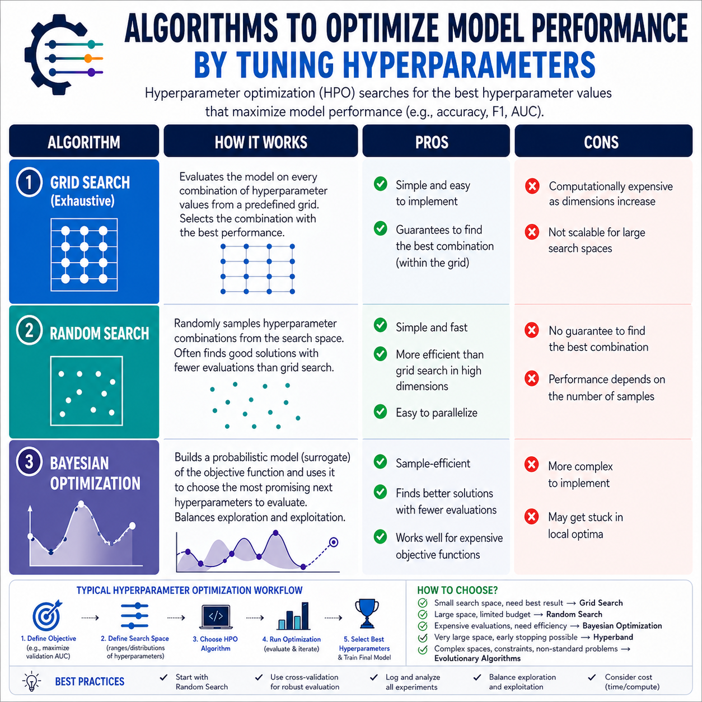

# Lessons Learned

These lessons are annotations from practical exercises from [Whizlabs AWS Certified AI Practitioner](https://www.whizlabs.com/aws-certified-ai-practitioner/)

## Guidelines for Responsible AI

The benefits of using ***Amazon Bedrock*** over building and managing your own models is to reduce cost and complexity and have access to the latest cutting-edge models without the need for in-house expertise.

A ***SageMaker Model Card*** serves as a comprehensive documentation hub for a *machine learning model* to capture and communicate key information about the model, promoting transparency and facilitating *responsible AI* development and deployment which includes model's purpose, intended use, *performance metrics*, ethical considerations and relevant information that helps stakeholders understand and evaluate the model.

***SageMaker*** *real-time hosting services* are specifically designed to provide persistent *endpoints* that are always available and ready to serve predictions with low *latency*. They are optimized for handling individual prediction requests in real time, making them ideal for applications that require immediate responses, such as chatbots, recommendation engines and fraud detection systems.

To enhance a chatbot's capabilities is using *Retrieval-Augmented Generation (RAG)* to enhance the responses with relevant and factual information from their knowledge base. The knowledge base in *Retrieval-Augmented Generation (RAG)* acts as a source of domain-specific information for the model to reference during the generation process.

*Provisioned Throughput* allows the company to reserve a specific capacity for their ***Bedrock*** models, ensuring that they can handle the increased traffic even during peak periods. This eliminates the risk of delays and provides a consistent experience for customers.

These factors are crucial for an *AI* technology to be considered trustworthy: **Fairness**, **Transparency**, **Accountability** and **Privacy**.

*Red teaming* is an adversarial approach specifically aimed at proactively identifying weaknesses and vulnerabilities in a system. It involves simulating real-world attacks and adversarial scenarios to expose potential flaws that might be exploited by malicious actors or lead to unintended harmful consequences.

*Jailbreaking* a *FM* refers to manipulating the model through crafted prompts to bypass its safety mechanisms and generate responses that it would normally restrict, such as offensive, harmful or unethical content.

***Amazon Kendra*** is an intelligent search service designed to simplify the integration of *natural language search* capabilities into your applications, including chatbots. It can connect to a variety of data sources, such as knowledge bases, to deliver accurate and relevant search results.

## Fundamentals of AI and ML

The *N-gram* transformation with a window size of 3 from the input *"This product is amazing and exceeded my expectations"* is: ["This product is", "product is amazing", "is amazing and", "amazing and exceeded", "and exceeded my", "exceeded my expectations"]. A *trigram* is a sequence of three consecutive words.

One option to deploy in ***Amazon SageMaker*** is *Serverless Inference*, which is the optimal choice for workloads characterized by fluctuating traffic patterns with idle periods. It automatically scales compute resources up or down based on demand. This makes it cost-effective for applications with unpredictable or intermittent use patterns.

There are some *algorithms* to optimize the model's performance by tuning its *hyperparameters*:

- **Grid Search**: It involves defining a grid of possible *hyperparameter* values and systematically evaluating the model's performance for each combination of values. It is a brute-force approach that can be computationally expensive but guarantees finding the best combination within the defined grid.
- **Bayesian Optimization**: It is an advanced method that leverages a probabilistic model to steer the search for optimal *hyperparameters*. It learns from past evaluations to select the next set of values to test.
- **Random Search**: It involves randomly sampling *hyperparameter* values from a defined range and evaluating the model's performance for each set of sampled values.

***Amazon Transcribe*** is specifically designed for *automatic speech recognition (ASR)*, making it the ideal choice for converting spoken language in videos into text that can then be analyzed by *LLMs* or other *AI models*.

In ***Amazon Rekognition*** there is a feature designed for detecting scene changes in videos by identifying these transitions. You can efficiently capture representative frames from each scene, avoiding redundant processing and ensuring that captions are generated for the most relevant parts of the video.

The best *ML algorithm* to predict customer churn is *Decision Tree* and *Support Vector Machine (SVM)*. *Decision Trees* are well-suited for *classification tasks* and can handle both numerical and categorical data. *Support Vector Machines (SVM)* are powerful *classification algorithms* that can handle high-dimensional data and non-linear relationships, making them effective for binary classification problems like churn prediction, especially when the data is well-separated.

***Amazon SageMaker*** *K-Means clustering algorithm* is specifically designed for *unsupervised learning* tasks like customer segmentation. It can analyze customer spending patterns in ***Redshift***, for example, and identify distinct groups of clusters.

The *k-NN (k-Nearest Neighbors)* plugin is specifically designed to extend the capabilities of ***Amazon OpenSearch Service*** by enabling efficient *k-nearest neighbor search*. This type of search is fundamental for finding documents or items that are most similar to a given query, based on their *vector embeddings*.

The *agent* is the core decision-maker in a *reinforcement learning* system. It interacts with the environment, observes its current state, takes actions based on its *policy* and receives *rewards* or *penalties* based on the outcomes of those actions. The agent's primary goal is to learn from these experiences and improve its *policy* over time to maximize its *cumulative reward*.

*Root Mean Square Error (RMSE)* is a metric specifically designed for *regression problems*, where the goal is to predict a continuous numerical value. It measures the average magnitude of the errors between the predicted values and the actual values. In the context of classifying emails as spam or not spam, the output is categorical, not a continuous numerical value. For these scenarios metrics like *Accuracy*, *Precision*, *Recall* or *F1 Score* would be more appropriate for evaluating the performance of the model.

*A/B testing's* core purpose is to conduct controlled experiments in a real-world setting by directing a portion of live traffic to a new model variant while the majority still goes to the existing model. This helps you make data-driven decisions about whether to fully adopt the new model, make further improvements or stick with the existing one.

*Computer Vision* is a field of *AI* that enables computers to "see" and interpret images. It involves techniques for analyzing and understanding visual information to extract relevant features from images. It makes *computer vision* ideal for building applications that automatically tag and categorize images in a large photo library, for example.

***AWS Glue Data Catalog*** directly supports reliable, repeatable and auditable *ML data pipelines* by providing a centralized metadata repository that allows you to organize, discover and manage your data assets. It enables you to create and maintain a catalog of your data sources, including their *schemas*, formats and locations. This ensures that your *ML pipelines* can easily access and utilize the necessary data while maintaining data governance and compliance standards.

The Reinforcement Learning(RL) helps to navigate complex and unpredictable aML model through trial-and-error methods. The model is *awarded* and *punished* for the decision it makes and therefore this makes the model to *learn* by trial-and-error technique.

The metrics `Mean Absolute Error` and `Mean Absolute Percentage Error` are specifically designed for *regression problems* where the goal is to predict a continuous numerical value. They measure the average magnitude of the errors between the predicted values and the actual values, with MAE providing an absolute error measure and MAPE expressing the error as a percentage of the actual values.

`Linear Regression` is a supervised learning algorithm. It aims to find the best-fitting linear relationship between a dependent variable and one or more independent variables. It requires labeled data to train the model.

`K-Means Clustering` is a classic unsupervised learning algorithm. It aims to partition n observations into k clusters in which earc observation belongs to the cluster with the nearest mean, serving as a prototype of the cluster. It identifies patterns and groupings within the data based on inherent similarities.

## Fundamentals of Generative AI

The benefits of using *Gen AI* in summarization of ***CloudWatch*** logs are:

- Accelerate incident triage by providing a concise overview of recent log events
- Enable proactive identification of potential issues or anomalies
- Facilitate better collaboration and communication among teams

*ROUGE (Recall-Oriented Understudy for Gisting Evaluation)* is a widely adopted metric specifically designed for evaluating the quality of automatic summarization systems. It compares the generated summary against one or more human-written reference summaries by calculating the overlap of *n-grams*. Higher *ROUGE scores* generally indicate a better match between the generated summary and the reference summaries.

The prompt technique to mitigate overly long and verbose responses are:

- Specify a concise response format in the prompt
- Limit the model's *token* generation capacity

The technique to enhance the accuracy and reliability of *Gen AI models* in summarizing customer reviews and extracting actions is *Prompt Engineering* and *Fine-tuning* the *foundation models* on domain-specific data.

The combination that best supports the goal of boosting agent productivity and reducing after-call work using *Gen AI* is ***Amazon Q in Connect*** which is a *Gen AI* assistant embedded in ***Amazon Connect*** that helps agents by providing real-time guidance, summarizing conversations and automating post-call documentation. ***Amazon Connect Contact Lens*** provides real-time analytics, sentiment analysis and transcription, which enhance the context and accuracy of *generative AI* outputs.

The differences between *Few-shot prompting* and *Zero-shot prompting* are:

- **Few-shot Prompting**: It incorporates examples to guide the model.
- **Zero-shot Prompting**: It relies solely on the model's pre-existing knowledge without providing any examples, making it more challenging for the model to generate accurate responses, especially for complex tasks or those requiring specific domain knowledge.

***Amazon Comprehend*** is the *natural language processing (NLP)* service designed to extract insights from text, including sentiment analysis and key phrase extraction. This makes it the ideal choice for analyzing customer reviews and understanding their opinions.

*AutoML* refers to the automation of typical steps in the model development workflow, eliminating often tedious and time-consuming steps involved in building *ML models*, such as *data preprocessing*, *feature engineering*, *algorithm selection*, *hyperparameter tuning* and even model evaluation.

The concept of *knowledge cutoff* is when an *LLM* provides outdated information about a recent event.

The best *algorithm* for customer churn prediction is *Decision Tree* and *Support Vector Machine (SVM)*. *Decision Trees* are well-suited for *classification tasks* and can handle both numerical and categorical data. *Support Vector Machines (SVM)* are powerful *classification algorithms* that can handle high-dimensional data and non-linear relationships, effective for binary classification problems like churn prediction, especially when the data is well-separated.

***Amazon SageMaker's*** *K-Means clustering algorithm* is specifically designed for *unsupervised learning* tasks like customer segmentation. It can analyze customer spending patterns in ***Redshift*** and identify distinct groups or clusters.

Three ways the human feedback can be collected during *Human-in-the-Loop (HITL)* process are:

- To *fine-tune* the *LLMs* and improve their performance
- To identify potential *biases* or inconsistencies in the models
- To track changes in model performance over time

*Reranking algorithms* are designed to refine the initial set of search results retrieved based on *semantic similarity*. By applying *reranking* techniques, the system can prioritize documents that are not only highly relevant to the query but also diverse in content. This ensures that users receive a broader range of pertinent information, reducing redundancy and improving the overall quality of the search results.

*Word2Vec algorithm* aims to learn word representations that capture *semantic* and *syntactic* relationships between words.

***Amazon SageMaker JumpStart*** is a hub that offers a wide array of pre-built and customizable solutions, *algorithms*, and models. These cover various *ML* and *Gen AI* use cases. It provides a quick and easy way to get started with common *ML* tasks and accelerates development by providing ready-to-use solutions.

The benefits of ongoing *pre-training* of *FMs* on domain-specific data allows the *FM* to continue learning from new and relevant text data, especially from the target domain. It helps the model to adapt its internal representations, improve understanding of domain-specific terminology and ultimately deliver better results when *fine-tuned* for specific downstream tasks.

***Amazon SageMaker Inference Recommender*** automates load testing and benchmarking across a range of ***SageMaker*** instance types and *endpoint* configurations (*real-time*, *serverless*, *multi-model*) and it helps you:

- Automatically evaluate model performance (*latency*, *throughput*)
- Get recommendations for best cost-performance match
- Avoid manual testing or trial-and-error deployments

***Bedrock*** with *RAG* via *Knowledge Bases* enables *Gen AI* with context injection using enterprise data (like docs in ***S3***) where:

- No *fine-tuning* is required
- Fully managed setup (no infrastructure maintenance)
- Reduces *hallucinations* using *RAG*
- Works out-of-the-box with top *FMs* like Claude, Llama 3 or Titan

***Amazon Bedrock*** with private customization and ***AWS PrivateLink*** provides:

- *HIPAA* eligibility and *GDPR* compliance
- Encryption at rest and in transit by default
- Optional ***KMS*** key integration
- Support for ***PrivateLink*** to eliminate public internet exposure
- No-code customization of *FM* without training

## Applications of FMs

The *Exploratory Data Analysis (EDA)* is the investigative phase of the *ML pipeline* where you delve into your dataset to understand its structure, distributions and relationships between variables which involves visualizing the data through plots and charts, calculating summary statistics and identifying potential outliers or anomalies.

There are three techniques for *model compression*:

- **Pruning**: It involves removing redundant or less important parameters from the model, effectively reducing its size and computational requirements.
- **Quantization**: It reduces the *precision* of the model's weights, representing them with fewer bits. This leads to a smaller memory footprint and often faster *inference*, making it a common *model compression* technique.
- **Distillation**: It involves training a smaller "student" model to mimic the behavior of a larger "teacher" model. This allows you to deploy a more compact and efficient model while retaining a significant portion of the original model's performance.

The context of *FM* the key application is to enable the creation of Account Summaries, providing comprehensive and personalized insights into customer accounts by integrating data from various sources.

These AWS services support storing and querying *vector embeddings*: ***Amazon S3*** with *S3 Vectors*, ***Amazon OpenSearch Service*** and ***Amazon RDS for PostgreSQL*** with *pgvector extension*.

The purpose of *Diffusion* in a *diffusion model* is a process where *Gaussian noise* is gradually added to the original image over multiple steps. This creates a sequence of increasingly noisy images, culminating in an image that is almost pure noise.

The role of ***Amazon Multimodal Embeddings G1*** is specifically designed to generate numerical representations (*embeddings*) for both textual and visual data.

The optimal number of epochs for *fine-tuning* is *Validation Output Accuracy* and *Validation Loss*. These metrics directly measure how well your model is performing on unseen data. A higher *validation accuracy* generally indicates a better model.

The deployment strategy known as *Shadow Deployment* is a technique where the new model version runs in parallel with the existing one, receiving the same input, but its output is not sent back to the user. Instead, the output is typically logged or analyzed offline.

***Amazon SageMaker Autoscaling Policies*** are designed for automatic scaling of ***SageMaker*** *endpoints* based on predefined metrics and thresholds.

*Quantization* is the process of reducing the number of bits used to represent the model's weights and activations to reduce the memory footprint of the model, enabling faster loading and *inference*, especially on resource-constrained devices.

***Amazon SageMaker Ground Truth*** is a service specifically designed to facilitate *human-in-the-loop ML* tasks, including collecting and managing human feedback for techniques like *Reinforcement Learning from Human Feedback (RLHF)*.

The differences between *Fine-tuning* and *Parameter-Efficient Fine-Tuning (PEFT)* are:

- **Fine-tuning**: You update all the parameters of the *pre-trained model* during the adaptation process and it can be computationally expensive and memory-intensive, especially for large models.
- **Parameter-Efficient Fine-Tuning (PEFT)**: It focuses on updating only a small subset of the parameters or adding new parameters in a computationally efficient way, leading to significant savings in resources.

***Amazon Titan Text*** is a *Gen LLM* on ***Amazon Bedrock*** specifically designed to handle a variety of text generation tasks, making it well-suited for responding to diverse prompts and questions and capable of summarization, text generation, classification, open-ended Q&A and information extraction.

***Amazon SageMaker Clarify*** is designed to help you identify and address potential *biases* in your *ML models*. It provides tools and techniques for analyzing the model's behavior, understanding *feature importance* and generating explanations for predictions.

*Self-attention* is at the heart of the *Transformer architecture's* ability to understand context and relationships within a sequence of data. It allows the model to focus on specific parts of the input sequence based on their relevance.

The *encoder-decoder models* are particularly well-suited for text summarization and machine translation tasks. The *encoder* processes the input sequence and captures its meaning, while the *decoder* generates the output sequence based on the *encoded representation*.

***Amazon Rekognition Custom Labels*** is a feature that allows you to train custom image (hosted in ***S3***) classification models using your own labeled dataset. It enables you to create models that are tailored to your specific use case and can recognize objects or scenes that are relevant to your application.

The major limitations of Gen AI is _Knowledge Cutoff_ and _Hallucinations_.

Those are relevant metrics for evaluating the performance of a *classification model*:
- `Perplexity`: Probably of a model to generate the given sequence of words. This metric is commonly used to assess the performance of language models, where a lower perplexity indicates a better fit to the data.
- `F1 score`: Balances the _precision_ and _recall_ of the model.
- `BERT score`: Measure the semantic similarity between the _reference_ and the _generated_ text.
- `Mean Squared Error(MSE)`: Average of the squared difference between predicted and actual values.

***Amazon SageMaker Automatic Model Tuning*** is specifically designed to automate the process of finding the best hyperparameters for a machine learning model. It runs multiple training jobs with different hyperparameter combinations and selects the model that performs best based on a defined objective metric.

***Amazon Bedrock Model Distillation*** involves transferring knowledge from an existing model, not training a completely new one from scratch.

## Security, Compliance and Governance for AI Solutions

***Amazon Bedrock's*** data privacy does not use the customer data to train or improve the ***Bedrock*** Service or the underlying *FMs*. It means that data is kept confidential and used solely for your own applications.

***CloudTrail Lake*** is a managed data lake that allows users to store and query ***CloudTrail*** events using *SQL-like syntax*. Customers can ingest ***CloudTrail*** events into ***CloudTrail Lake*** to analyze API activity, including user interactions with ***Amazon Bedrock***.

In a multi-tenant applications which uses ***DynamoDB*** table, the best approach to ensure which tenant accesses only their own data is through ***IAM*** policies. It involves providing each business with unique credentials that have permissions restricted to their specific data in ***DynamoDB***, enforcing access control directly at the database level, ensuring strong data isolation between tenants.

To ensure the secure connectivity between your application and ***Amazon Bedrock*** you can use ***AWS VPC Endpoints*** which enable establishing a private connection. This ensures that your data travels within the secure AWS network backbone, avoiding the public internet.

In the *AWS Shared Responsibility Model*, customers are responsible for the security of their applications and the data they process within those applications. It includes protecting against *prompt injection*, which involves carefully handling user input and implementing secure coding practices.

The primary goal of *Reinforcement Learning from Human Feedback (RLHF)* is to align the model's output with human values and preferences.

*Area Under the ROC Curve (AUC)* is a powerful metric for evaluating *classification models*, especially when you need to understand the trade-off between *true positive rate (sensitivity)* and *false positive rate (1-specificity)*. The *ROC curve* plots the *true positive rate* against the *false positive rate* at various classification thresholds and the *AUC* represents the overall area under this curve. A higher *AUC* indicates a better model that can effectively distinguish between the positive and negative classes across different thresholds.

The ensure the secure connectivity between your application and Amazon Bedrock you can use AWS VPC Endpoints which enables establish a private connection. This ensure that your data travels within the secure AWS network backbone, avoiding the public internet.

In the AWS Shared Responsibility Model, customers are responsible for the security of their applications and the data they process within those applications. It includes protecting against prompt injection, which involves carefully handling user input and implementing secure coding practices.

The primary goal of Reinforcement LEarning from Human Feedback(RLHF) is to align the model's output with human values and preferences.

`Area Under the ROC Curve (AUC)` is a powerful metric for evaluating classification models, especially when you need to understand the trade-off between true positive rate(sensitivity) and false positive rate(1-specificity). The ROC curve plots the true positive rate against the false positive rate at various classification thresholds and the AUC represents the overall area under this curve. A higher AUC indicates a better model that can effectively distinguish between the positive and negative classes across different thresholds.
