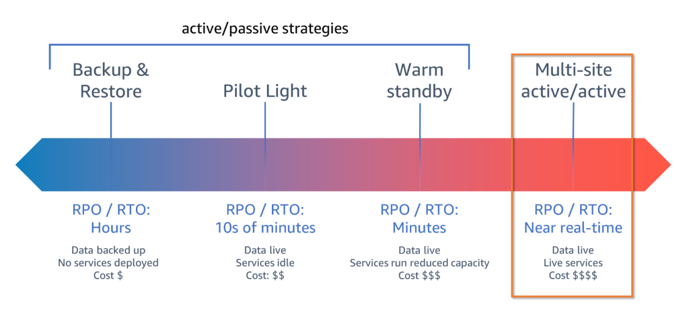
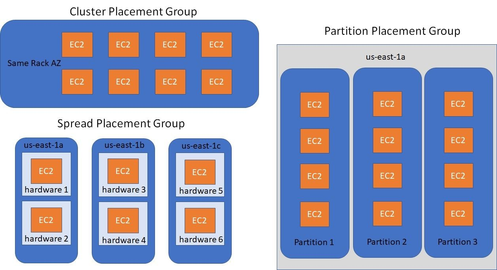
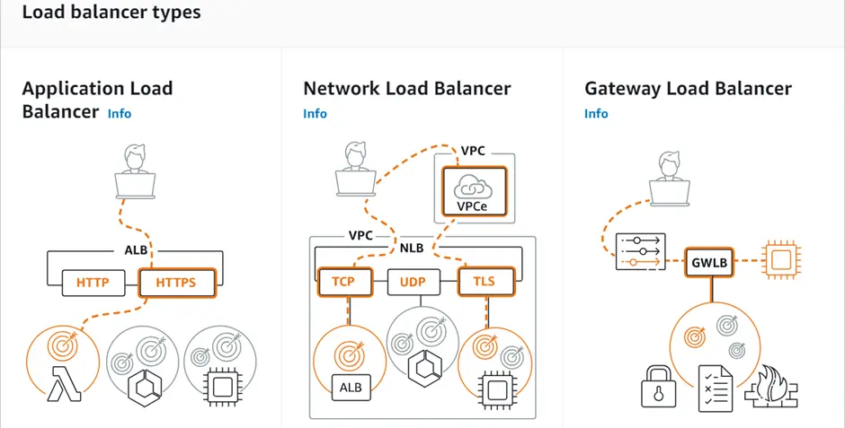
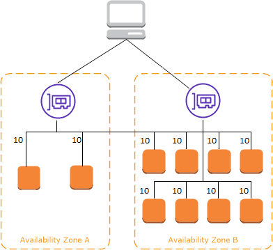
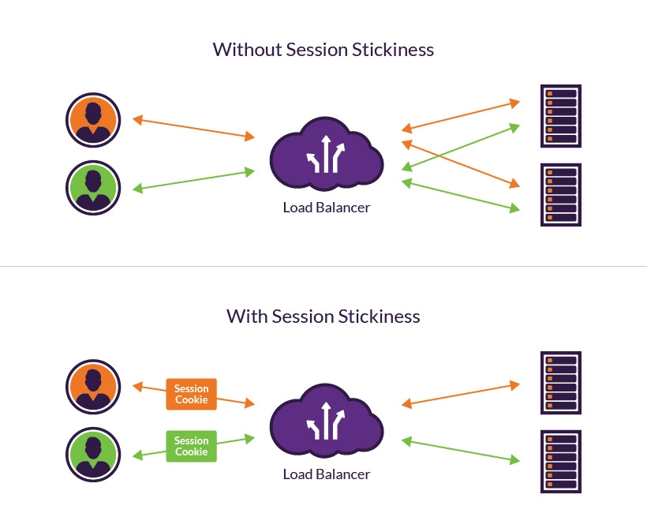

# AWS Certified Solutions Architect - Associate (SAA-C03)

Those annotations are from [Whizlabs course](https://www.whizlabs.com/learn/course/aws-solutions-architect-associate/153) and from [AWS Course](https://skillbuilder.aws/category/exam-prep/solutions-architect-associate-SAA-C03).

## Overview

**The Main Pillars of the AWS Well-Architected Framework:**
- Operational excellence
- Cost optimization
- Reliability
- Security
- Sustainability
- Performance efficiency

## Design Secure Architectures (Domain 1)

### Design Secure Access to AWS Resources

You should know how to do the following:
- Apply AWS security best practices to AIM users and root users
- Design a flexible authorization model that includes IAM users, groups, roles and policies
- Design a role-based access control strategy
- Design a security strategy for multiple AWS accounts
- Determine the appropriate use of resource policies for AWS services
- Determine when to federate a directory service with IAM roles

What is a policy? It is a object that when associated with an identity or resource, define their permissions. There are two types of policies:
- `Identity-based policies`: These policies are attached to an IAM identity (user, group, or role) and define what actions that identity can perform on which AWS resources.
- `Bucket policies`: These policies are attached to an S3 bucket and define what actions can be performed on the bucket and its objects, and by whom.

### Design Secure Workloads and Application

There are two types of Amazon VPC, `default` e `custom`. The default VPC is automatically created in each AWS region and comes with a default subnet in each AZ. The custom VPC allows you to create your own network topology, including subnets, route tables, and security groups.

What is a subnet? It is where our services sit and run from inside our Amazon VPCs. They help to add structure and functionality to our VPCs. Subnets are an AZ resilient feature of AWS.

What is an endpoint service? They are gateway objects that we can create inside our VPC to connect to AWS public services without the need of a gateway like the internet gateway or the NAT gateway.

### Determine Appropriate Data Security Controls

In this section whether the data is in transit or at rest, it security needs to be evaluated. For the exam, you should know there are two types of encryption:
- At-rest encryption: This type of encryption protects data when it is stored on disk. AWS services that support at-rest encryption include Amazon S3, Amazon EBS, and Amazon RDS.
- At-transit encryption: This type of encryption protects data when it is transmitted over a network.

## Design Resilient Architectures (Domain 2)

Scaling is the ability to increase or decrease the capacity of a system based on demand. There are two types of scaling:
- `Horizontal scaling`: This type of scaling involves adding more instances to a system to increase its capacity. For example, adding more EC2 instances to a load balancer.
- `Vertical scaling`: This type of scaling involves increasing the resources of an existing instance to increase its

Elasticity is the ability of a system to automatically scale up or down based on demand.

### Design scalable and loosely coupled architectures

### Design of highly available and/or fault-tolerant architectures

For the exam, you should know about:
- `High availability`: It means designing for minimal downtime.
- `Fault tolerance`: It means designing for zero downtime.
- `Disaster recovery`: It means designing for recovery from a disaster.

For Disaster recovery objectives, you should know about the following strategies:
- `Recovery Point Objective(RPO)`: It is the maximum acceptable amount of time since the last data recovery point. Backups are taken every so many hours:minutes:seconds based on requirements.
- `Recovery Time Objective(RTO)`: It is the maximum acceptable delay between the interruption of service and restoration of service measured in hours:minutes:seconds based on requirements.

## Design High-Performing Architectures (Domain 3)

### Determine high-performing and/or scalable storage solutions

In AWS, storage is available in three forms:
- `Object storage`: It is a type of storage that stores data as objects. Amazon S3 is an example of object storage.
- `Block storage`: It is a type of storage that stores data as blocks. Amazon EBS. It will scale automatically as the amount of data stored increases, up to a maximum of 16 TB per volume.
- `File storage`: It is a type of storage that stores data as files. Amazon EFS is an example of file storage.

What level of resiliency is S3? It is a globally resilient service and it ran in every AWS Region.

### Design high-performing and elastic compute solutions
In AWS, compute is available in three forms:
- `Intances`:
- `Containers`:
- `Functions`:

### Determine high-performing database solutions

Aurora is very different from RDS. Aurora uses the base architecture of a cluster. It is a cluster made up of a single primary instance and then zero or more replicas and Aurora has global database that can span multiple AWS regions.

RDS Proxy maintains a pool of established connections to your RDS instances. This reduce the stress on your compute and memory resources and support a large number and frequency of connections to help your application to scale.

### Determine high-performing and/or scalable network architectures
### Determine high-performing data ingestion and transformation solutions

## Design Cost-Optimized Architectures (Domain 4)

### Design cost-optimized storage solutions

### Design cost-optimized compute solutions
### Design cost-optimized database solutions
### Design cost-optimized network architectures

## Whizlabs Course

### Compute

For EC2 instances, there are instance families include general purpose, compute, optimized, memory optimized and storage optimized. The EC2 instances are represented by a letter and a number. The letter represents the instance family and the number represents the generation of the instance. For example, `t3` is a general purpose instance of the third generation.

#### Purchasing Options, Saving Plans and Tenancy models

There are some purchasing options for EC2 instances:
- `On-Demand`: You pay for compute capacity by the hour or second (depending on which instances you run) with no long-term commitments. This option is best for users that want the flexibility to use EC2 instances without any upfront payment or long-term commitment.
- `Reserved`: You can reserve an EC2 instance for a one-year or three-year term and receive a significant discount compared to On-Demand pricing. This option is best for users that have predictable workloads and can commit to using EC2 instances for a long period of time.
- `Spot Instances`: You can bid on unused EC2 capacity and run those instances for as long as your bid exceeds the current Spot price. This option is best for users that have flexible workloads and can tolerate interruptions.

##### Saving Plans

Those are the advantages of Saving Plans:
- Flexible pricing model that allows users to save up to 72% on their compute usage.
- Applies to EC2, Fargate and Lambda.
- Provide users with a discounted hourly rate in exchange for a commitment to use a specific amount of compute usage over a term of one or three years.
- Flexibility of moving compute usage across different instance families, sizes and regions within the same instance type.
- Saving Plans give you the flexibility to use the compute option that best suits your needs at low prices, without having to perform exchanges or modifications.

##### Tenancy models

There are three tenancy models for EC2 instances:
- `Shared tenancy`: This is the default tenancy model for EC2 instances. In this model, your EC2 instances run on shared hardware with other AWS customers.
- `Dedicated tenancy`: In this model, your EC2 instances run on hardware that is dedicated to you. This means that your instances will not share hardware with other AWS customers.
- `Dedicated Instances`: In this model, your EC2 instances run on hardware that is dedicated to you, but they are not physically isolated from other AWS customers. This means that your instances may share hardware with other AWS customers, but they will not share the same physical server.

#### EC2 Encryption

EBS encryption uses KMS keys when creating encrypted volumes and snapshots; Encrypts volume with a data key using the industry-standard AES-256 algorithm and it happens on the servers securing data-at-rest and data-in-transit between an instance and its attached EBS storage. You can encrypt the boot and the data volume of an EC2 instance.

#### EC2 Placement Groups

EC2 placement groups are a logical grouping of instances within a single Availability Zone. They are used to optimize the network performance of your instances. There are three types of placement groups:
- `Cluster`: It is recommended for applications that require low latency and high throughput.
- `Partition`: It is recommended for applications that require high availability and fault tolerance.
- `Spread`: It is recommended for applications that require high availability and fault tolerance.

All those types of placement groups are used to optimize the network performance of your instances.

Which are the rules and limitations of placement groups?
- You can create a maximum of 500 placement groups per account in each region.
- The name of the placement group must be unique within the region.
- Placement groups can not be merged.
- An instance can be launched in one placement group at a time; It can not span multiple placement groups.
- Can't launch Dedicated Hosts, a Spot instance that is configured to stop or hibernate or interruption in placement groups.
- It enables instances to utilize up to 10 Gbps for single-flow traffic, while instances outside of a cluster placement group have a limit of 5 Gbps for single-flow traffic.
- Launching multiple instance types in a cluster placement group reduces the likelihood of finding the necessary capacity for a successful launch, so it is recommended to use the same instance type for all instances int he group.

For sharing placement groups:
- You can share it across multiple AWS accounts or within your AWS Organization.
- You can not share it that has been shared with you.
- When you share a partition or spread placement group, the placement group limits do not change.
- To share in your AWS Organization, you must enable sharing with AWS Organizations.
- You are responsible for managing the instances owned by you in a shared placement group.
- You can not modify instances and capacity reservations that are associated with a shared placement group but not owned by you.

#### Public, Private and Elastic IP Addresses

##### IP Addressing in VPC

By default, EC2 and VPC use the IPv4 addressing protocol. When you create a VPC, you must to assing it an IPv4 CIDR block. To connect to your instance over the internet or enable communication between your instance and other AWS services that have public endpoints, assign a globally-unique public IPv4 address to your instance. In order to have your instances communicate with the internet, you need to attach an internet gateway to your VPC and it will communicate through IPv4, IPv6 or both.

The differences between IPv4 and IPv6 are:
- `IPv4`: VPC cider block site can be from 16 to 28 and the subnet cider block is 16 to 28. They are allowed to use elastic IP addresses
- `IPv6`: VPC cider block is fixed at 56 and the subnet cider block is fixed at 64. There are not any distinguishes between private and public IP addresses. All IP addresses are public. In IPv6, you can not use elastic IP addresses because all IP addresses are public and globally unique.

Differences between public and elastic IP addresses are, public automatically assigned to instances in a default VPC and they are released when the instance is stopped or terminated. Elastic IP addresses are static and they are associated with your AWS account. You can associate an elastic IP address with an instance or a network interface and it will remain associated until you choose to disassociate it. For Elastic IP addresses, you are charged for each hour that the address is not associated with a running instance and for each GB of data transferred out of the address.

#### AWS ENI, ENA and EFA

Those are network interfaces card options for EC2 instances and they mean:
- `Elastic Network Interface(ENI)`: It is a basic network interface that you can have. It is used in web servers and database servers and no high-performance requirements.
- `Elastic Network Adapter(ENA)`: It uses a single root IO virtualization(RIO) to provide high performance networking. It is used in applications that require higher bandwidth and lower inter-instance latency and it is supported on limited EC2 instance types (HVM only).
- `Elastic Fabric Adapter(EFA)`: It uses to accelerate high performance computing(HPC) and machine learning(ML) applications. It provides low latency and high throughput for inter-instance communication. It is used for high performance computing(HPC), such as ML and tightly coupled applications.

A `ENI` can have:
- A primary private IPv4 address from the IPv4 address range of your VPC.
- One or more secondary private IPv4 addresses from the IPv4 address range of your VPC.
- One Elastic IP address per private IPv4 address.
- One public IPv4 address and one or more IPv6 addresses.
- One or more security groups.
- A MAC address.

A `ENA` can have:
- Custom network interface optimized to deliber high thrtoughput packet per second(PPS) performance and low latency.
- There are two implementations:
  - Elastic Network Adapter(ENA), which support network speeds of up to 100 Gbps.
  - Intel 82599 Virtual Function(VF) interface, which support network speeds of up to 10 Gbps.

A `EFA` can have:
- Achieve the application performance of an on-prem HPC cluster, with the scalability, flexibility and elasticity of the cloud.
- `ENA` with added capabilities(additional OS-bypass functionality).
- OS-bypass is an access model that allows HPC and ML applications to communicate directly with the NIC hardware, low-latency transport functionality.

#### AWS Elastic Load Balancing(ELB)

Elastic Load Balancing automatically distributes incoming application traffic across multiple targets, such as EC2 instances, containers, and IP addresses. It can handle the varying load of your application traffic in a single Availability Zone or across multiple Availability Zones. The benefits of using ELB are:
- Increased availability and reliability;
- Improved performance;
- Reduced costs;
- Increased scalability and security;
- Easier management;

The types of ELB are:

##### Cross Zone Load Balancing

It distributes traffic across multiple AZ in a single AWS region. It helps to improve the availability and performance of your applications by preventing a single AZ from becoming a bottleneck.

The downside of using cross zone load balancing requires distributing EC2 instances across multiple AZs, adding complexity to application architecture and increasing costs due to inter-AZ data transfer fees.

##### ELB Stickiness

Stick sessions allow you to route requests to the same target in a target group. This is useful for applications that require session persistence, such as shopping carts or user profiles. The downside of using stick sessions is that it can lead to uneven load distribution and reduced availability if the target becomes unhealthy or fails.

